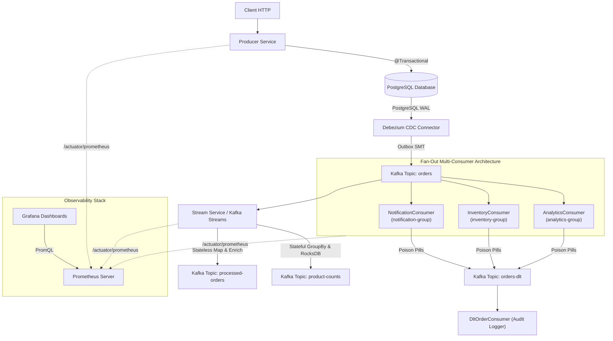

# Event Platform

A production-oriented Event-Driven E-Commerce platform built to learn Apache Kafka and modern data streaming technologies.

## Tech Stack

- Apache Kafka
- Spring Boot
- Java 21
- Docker & Docker Compose
- PostgreSQL
- Kafka Connect
- Debezium
- Kafka Streams

## Project Structure

```text
event_platform/
├── producer-service/
├── consumer-service/
├── connect/
├── stream-service/
├── docs/
└── docker-compose.yml
```

## Current Progress

- [x] Sprint 01 - Repository Setup
- [x] Sprint 02 - Docker Compose & Kafka Bootstrap
- [x] Sprint 03 - Spring Boot Producer
- [x] Sprint 04 - Spring Boot Consumer
- [x] Sprint 05 - PostgreSQL
- [x] Sprint 06 - Reliable Consumer Processing
- [x] Sprint 07 - Idempotency, Transactions & Outbox Pattern
- [x] Sprint 08 - Kafka Connect & Debezium CDC
- [x] Sprint 09 - Debezium Event Router (Outbox SMT)
- [x] Sprint 10 - Kafka Streams
- [x] Sprint 11 - Monitoring & Observability
- [x] Sprint 12 - Production Improvements
- [x] Sprint 13 - Event-Driven Microservices (Multi Consumer Architecture)

## Current Architecture



### Text Topology View

```text
               Client (HTTP)
                     │
                     ▼
              Producer Service
                     │
               @Transactional
                     │
        ┌────────────┴────────────┐
        ▼                         ▼
   Orders Table             Outbox Table
                                  │
                                  ▼
                            PostgreSQL WAL
                                  │
                                  ▼
                         Debezium Connector
                                  │
                                  ▼
                          Event Router SMT
                                  │
                                  ▼
                         Kafka Topic (orders)
                                  │
     ┌────────────────────────────┼────────────────────────────┬────────────────────────────┐
     ▼                            ▼                            ▼                            ▼
NotificationConsumer       InventoryConsumer            AnalyticsConsumer            Stream Service (KStream)
(notification-group)       (inventory-group)            (analytics-group)                   │
     │                            │                            │             ┌──────────────┴──────────────┐
     └────────────────────────────┼────────────────────────────┘             ▼                             ▼
                                  ▼                                Topic: processed-orders       Topic: product-counts
                          orders-dlt Topic                         (Event Enrichment)            (RocksDB Stateful Aggregation)
                                  │
                                  ▼
                         DltOrderConsumer (Audit)

  ========================================================================================
                                     OBSERVABILITY STACK
    [Grafana UI: Port 3000] ──(PromQL)──> [Prometheus: Port 9090]
                                                  │
                ┌─────────────────────────────────┼─────────────────────────────────┐
                │ (Scrape /actuator/prometheus)   │ (Scrape /actuator/prometheus)   │ (Scrape /actuator/prometheus)
                ▼                                 ▼                                 ▼
        Producer Service                  Consumer Service                  Stream Service
  ========================================================================================
```

## Current Features

- Spring Boot Producer Service
- Spring Boot Consumer Service
- Apache Kafka Producer & Consumer
- PostgreSQL Integration
- Spring Data JPA
- Manual Offset Commit
- Retry Strategy
- Dead Letter Topic (DLT)
- At-Least-Once Delivery
- Consumer Lag Analysis
- Transactional Outbox Pattern
- Kafka Connect
- Debezium CDC
- PostgreSQL Logical Replication
- WAL (Write Ahead Log)
- Change Data Capture (CDC)
- Automatic Event Publishing
- Debezium Event Router SMT
- Business Event Routing
- Aggregate-based Topic Routing
- Outbox Payload Transformation
- Automatic Topic Routing
- Kafka Streams (`@EnableKafkaStreams`)
- Real-Time Event Filtering & Enrichment
- Stateful Stream Aggregation (RocksDB State Store)
- Dynamic Re-keying & Topic Repartitioning
- KStream & KTable Dual Abstractions
- Spring Boot Actuator (`/actuator/prometheus`)
- Micrometer Prometheus Registry
- Prometheus Time-Series Scraper & DB Integration
- Grafana Metrics Visualization & Monitoring Dashboards
- Producer Idempotence & Exactly-Once Semantics (`enable.idempotence=true`)
- Classified Error Handling & Exponential BackOff Retries
- Dead Letter Topic (DLT) Exception Header Extraction & Audit Logging
- Consumer Concurrency (Parallel Processing Threads)
- Graceful Shutdown & Manual Offset Commit Tuning
- Event-Driven Microservices & Fan-Out Architecture (Publish-Subscribe Pattern)
- Multi-Consumer Group Isolation (`notification-group`, `inventory-group`, `analytics-group`)
- Centralized Error Handling & Automatic DLT Inheritance Across Consumers