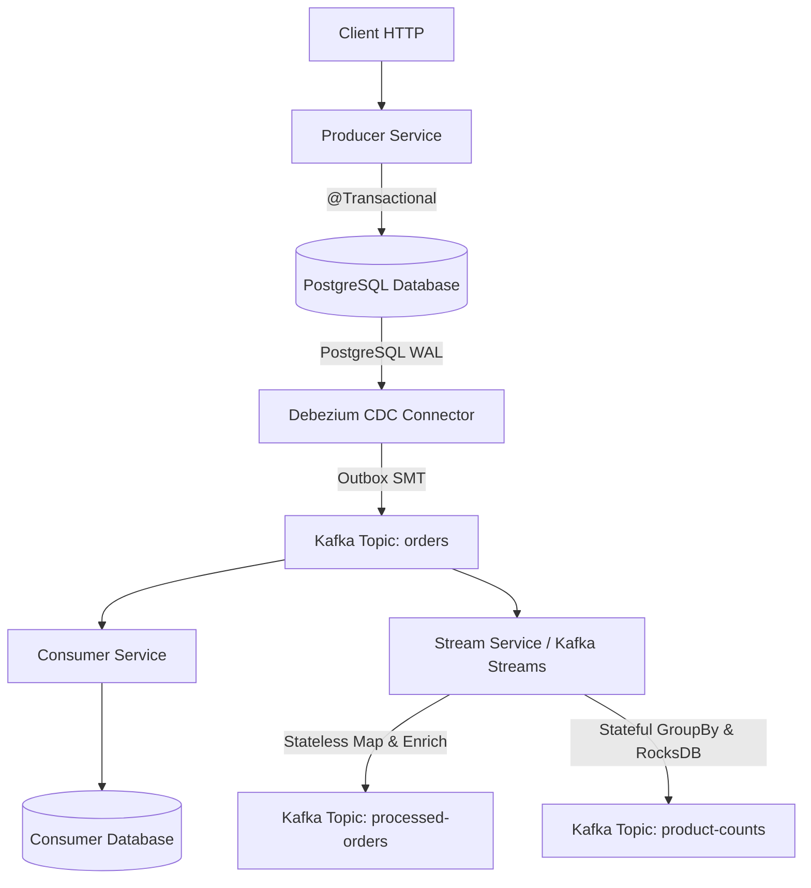

# Event Platform

A production-oriented Event-Driven E-Commerce platform built to learn Apache Kafka and modern data streaming technologies.

## Tech Stack

- Apache Kafka
- Spring Boot
- Java 21
- Docker & Docker Compose
- PostgreSQL
- Kafka Connect
- Debezium
- Kafka Streams

## Project Structure

```text
event_platform/
├── producer-service/
├── consumer-service/
├── connect/
├── stream-service/
├── docs/
└── docker-compose.yml
```

## Current Progress

- [x] Sprint 01 - Repository Setup
- [x] Sprint 02 - Docker Compose & Kafka Bootstrap
- [x] Sprint 03 - Spring Boot Producer
- [x] Sprint 04 - Spring Boot Consumer
- [x] Sprint 05 - PostgreSQL
- [x] Sprint 06 - Reliable Consumer Processing
- [x] Sprint 07 - Idempotency, Transactions & Outbox Pattern
- [x] Sprint 08 - Kafka Connect & Debezium CDC
- [x] Sprint 09 - Debezium Event Router (Outbox SMT)
- [x] Sprint 10 - Kafka Streams
- [ ] Sprint 11 - Monitoring & Observability
- [ ] Sprint 12 - Production Improvements
- [ ] Sprint 13 - Event-Driven Microservices (Multi Consumer Architecture)

## Current Architecture



### Text Topology View

```text
               Client (HTTP)
                     │
                     ▼
              Producer Service
                     │
               @Transactional
                     │
        ┌────────────┴────────────┐
        ▼                         ▼
   Orders Table             Outbox Table
                                  │
                                  ▼
                            PostgreSQL WAL
                                  │
                                  ▼
                         Debezium Connector
                                  │
                                  ▼
                          Event Router SMT
                                  │
                                  ▼
                         Kafka Topic (orders)
                                  │
         ┌────────────────────────┴────────────────────────┐
         ▼                                                 ▼
  Consumer Service                                  Stream Service (KStream)
         │                                                 │
         ▼                                ┌────────────────┴────────────────┐
   PostgreSQL DB                          ▼                                 ▼
                             Topic: processed-orders             Topic: product-counts
                             (Event Enrichment)                  (RocksDB Stateful Aggregation)
```

## Current Features

- Spring Boot Producer Service
- Spring Boot Consumer Service
- Apache Kafka Producer & Consumer
- PostgreSQL Integration
- Spring Data JPA
- Manual Offset Commit
- Retry Strategy
- Dead Letter Topic (DLT)
- At-Least-Once Delivery
- Consumer Lag Analysis
- Transactional Outbox Pattern
- Kafka Connect
- Debezium CDC
- PostgreSQL Logical Replication
- WAL (Write Ahead Log)
- Change Data Capture (CDC)
- Automatic Event Publishing
- Debezium Event Router SMT
- Business Event Routing
- Aggregate-based Topic Routing
- Outbox Payload Transformation
- Automatic Topic Routing
- Kafka Streams (`@EnableKafkaStreams`)
- Real-Time Event Filtering & Enrichment
- Stateful Stream Aggregation (RocksDB State Store)
- Dynamic Re-keying & Topic Repartitioning
- KStream & KTable Dual Abstractions